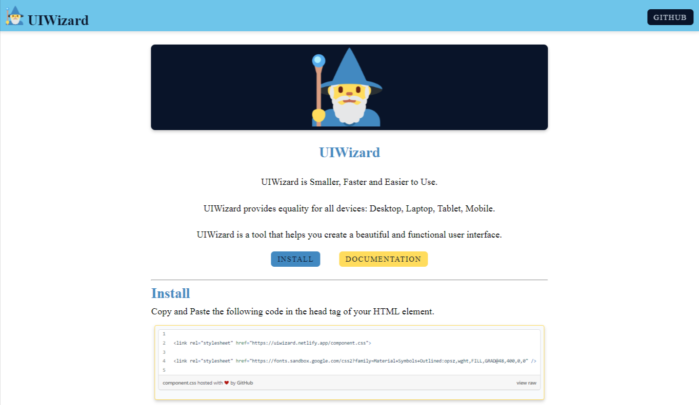
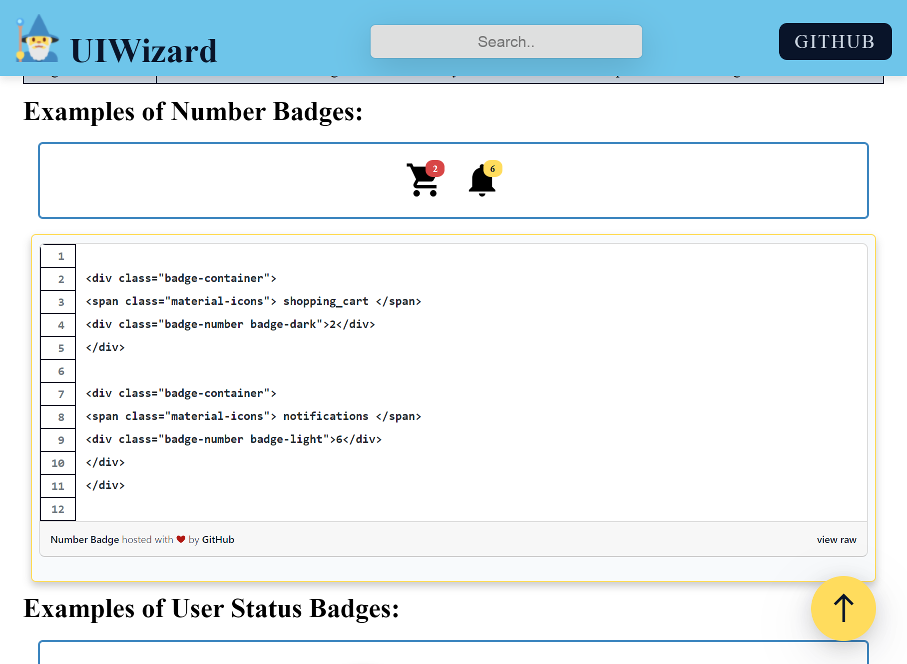

<div align="center">


# 📃 UIWizard ( [LIVE DEMO](https://uiwizard.netlify.app/) )

</div>
UIWizard is Smaller, Faster and Easier to Use component library built using
the HTML , CSS and little bit JavaScript.

##

[](https://github.com/VanshSh/UIWizard/issues)
[](https://github.com/VanshSh/UIWizard/network)
[](https://github.com/VanshSh/UIWizard/stargazers)
[](https://paypal.me/vanshsharma27)

## 📥 Installation

To get started with UIWizard add the following links
to the `<Head></Head>` tag og your HTML file.

```bash
<link rel="stylesheet" href="https://uiwizard.netlify.app/component.css">

<link rel="stylesheet" href="https://fonts.sandbox.google.com/css2?family=Material+Symbols+Outlined:opsz,wght,FILL,GRAD@48,400,0,0" />
```

## 📦 Components

-   Typography
-   Alert
-   Avatar
-   Badge
-   Button
-   Images
-   Navigation Bar
-   Modal
-   Slider
-   Snackbar/Toast

## 👨‍💻 Tech Stack

**Client:**   

**Host:** 

**Other Resources:**  

## 🎨 Color Reference

| Color          | Hex                                                               |
| -------------- | ----------------------------------------------------------------- |
| --primary      |  #091429  |
| --secondary    |  #6ec5ea  |
| --accent       |  #ffdc5d  |
| --light        |  #f8fafc  |
| --text-light   |  #cbd5e1  |
| --text-dark    |  #4289c1  |
| --danger       |  #d84646  |
| --danger-dark  |  #eb3737 |
| --success      |  #4e9a51  |
| --success-dark |  #3b7d2e  |
| --warning      |  #d4a13a  |
| --warning-dark |  #e99d04  |

## 📖 Lessons Learnt:

While building this project I learnt various things such as:

-   CSS selectors
-   Media hover query
-   Styling the GitHub gist

## 📷 Screenshots




## ⏲️ Roadmap

-   Add more components
-   Add Dark/Light theme for Website

## 🔗 Contact

[](http://vanshsharma.vercel.app/)
[](https://www.linkedin.com/in/vanshsharma27/)
[](https://twitter.com/Vanshsh2701)
